# Spectrum Engineering Company Website

A full-stack engineering company website built with PHP, MySQL, HTML, CSS, JavaScript, and GSAP.

The project includes a public-facing company website and a complete admin dashboard for managing the website content without editing source code manually.

## Project Overview

Spectrum is an 11-page engineering company website designed to present company information, services, projects, teams, news, locations, and other corporate content.

The website includes a dynamic admin dashboard that allows administrators to manage major sections of the website, including logos, images, sliders, projects, teams, services, news, and page content.

## Main Features

### Public Website

- Responsive multi-page company website
- 11 website pages
- Modern user interface
- GSAP animations and transitions
- Dynamic image sliders
- Company information and structure
- Services section
- Projects section
- Team page
- News page
- Contact and location pages
- Job application form
- Responsive footer and navigation
- Dynamic content loaded from the database

### Admin Dashboard

The admin dashboard provides centralized control over website content.

Administrators can manage:

- Website logo
- Homepage content
- Homepage image sliders
- Company information
- Company structure
- Services
- Projects
- Project titles and descriptions
- Multiple images for project sliders
- Team members
- Team information and images
- News articles
- News images
- Page images
- Website content displayed on different pages

## Technologies Used

### Frontend

- HTML5
- CSS3
- JavaScript
- GSAP
- Responsive Web Design

### Backend

- PHP
- MySQL

### Development Environment

- XAMPP
- Apache
- phpMyAdmin

### Version Control

- Git
- GitHub

## Website Screenshots

### Home Page

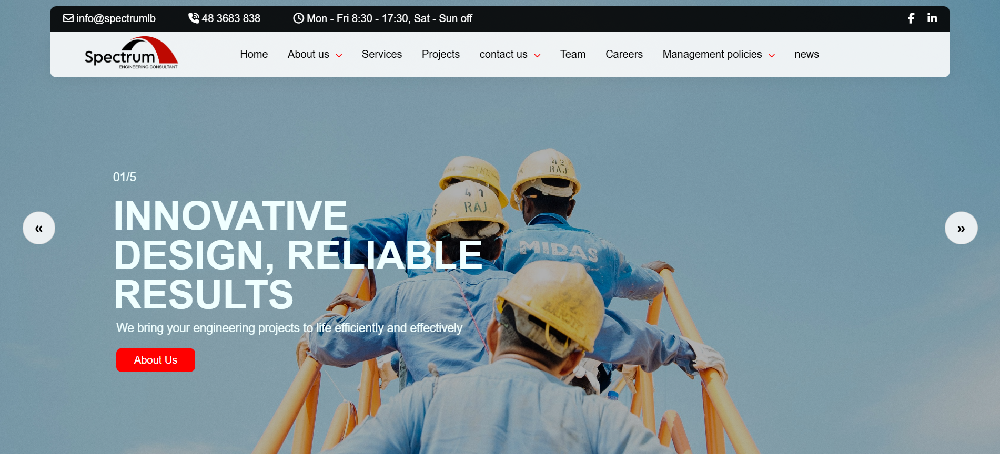

### Loading Page


### About Us

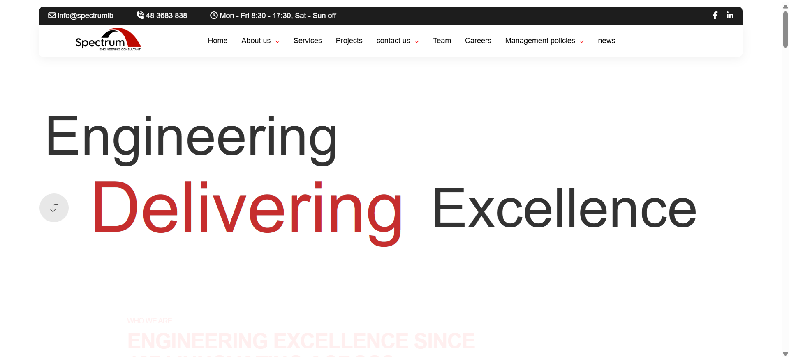

### Company Page

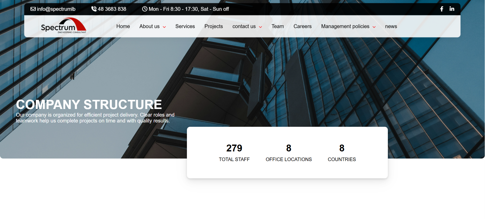

### Company Structure

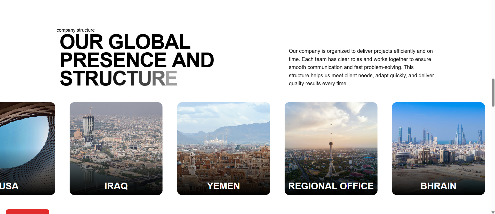

### Company Structure Details

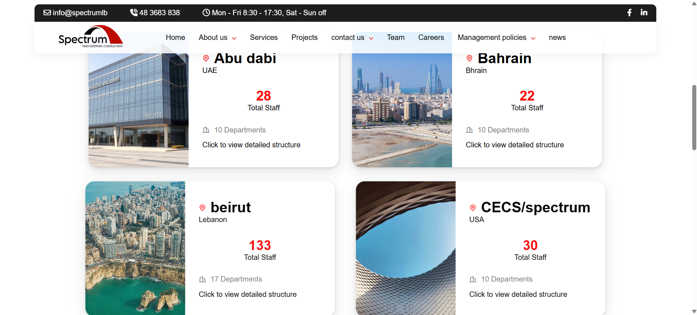

### Company Structure Popup

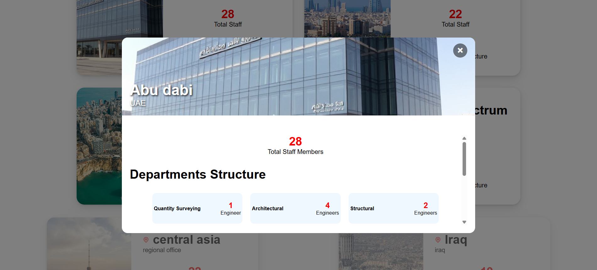

### Services

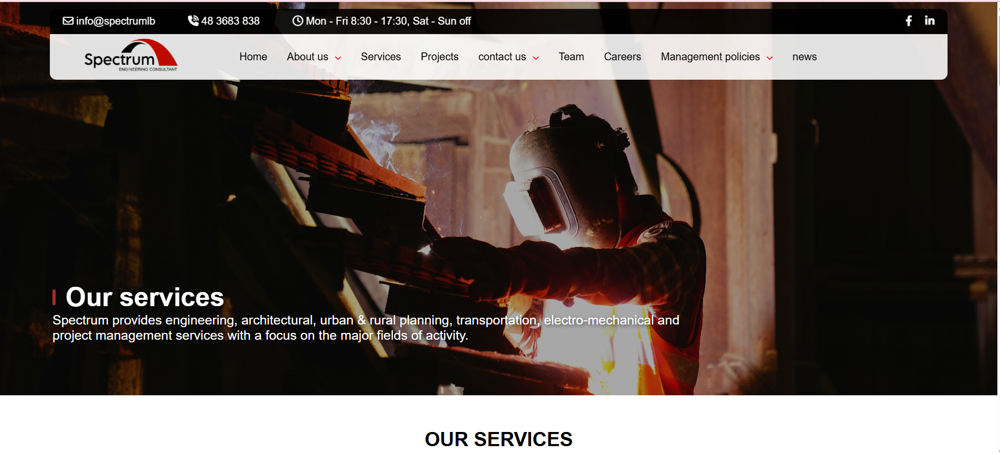

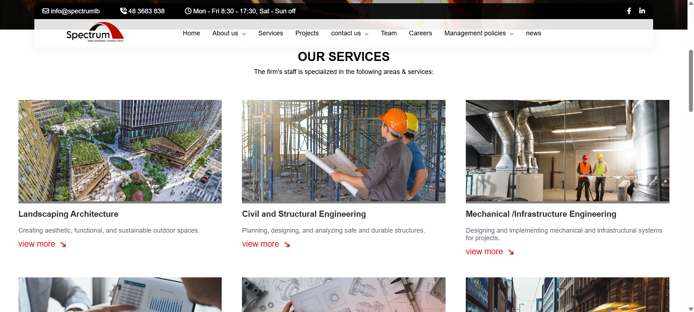

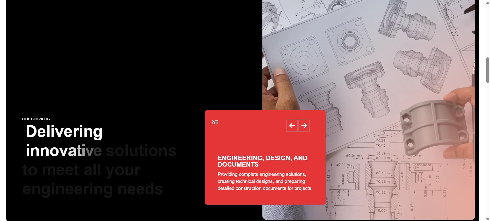

### Teams Page

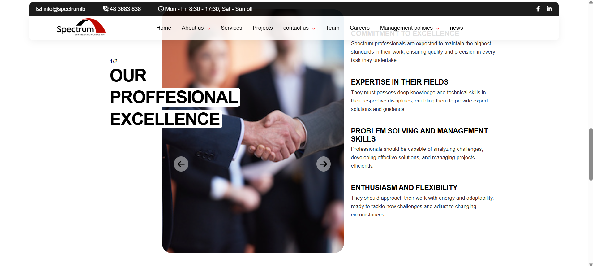

### News

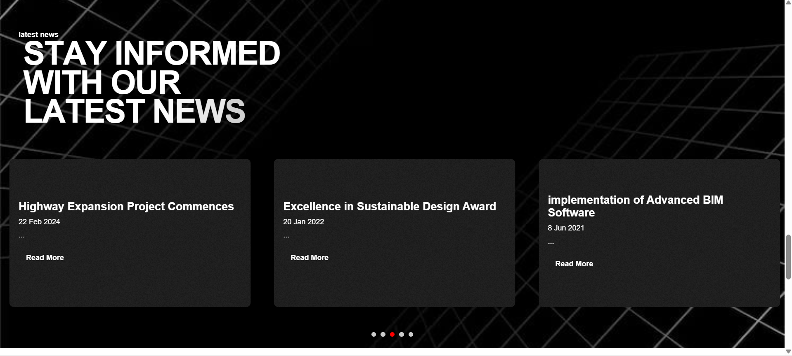

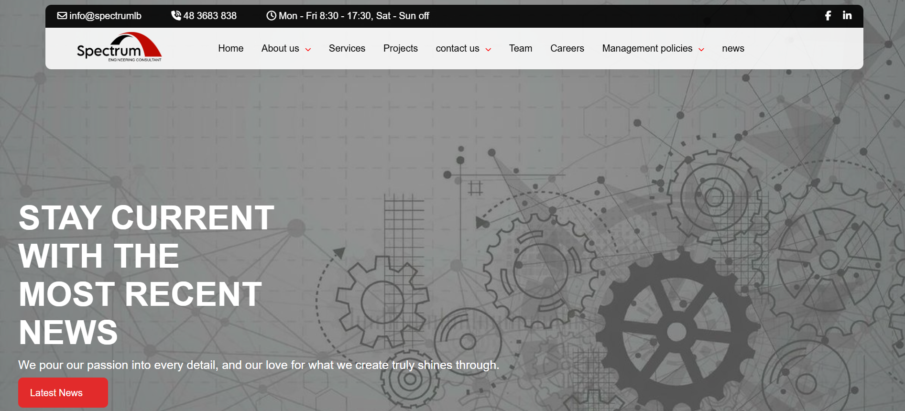

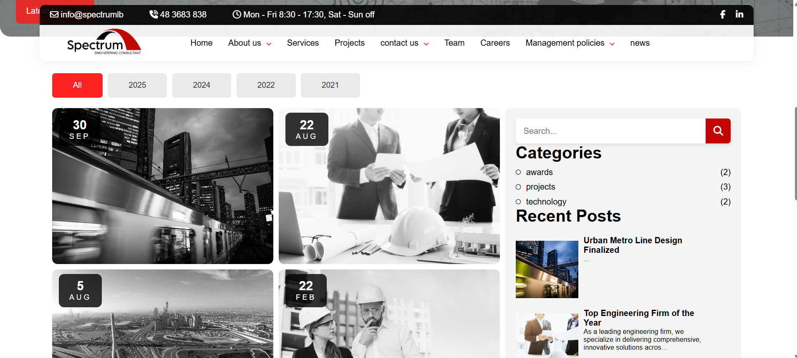

### Locate Us

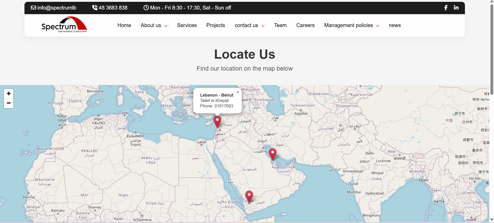

### Job Application

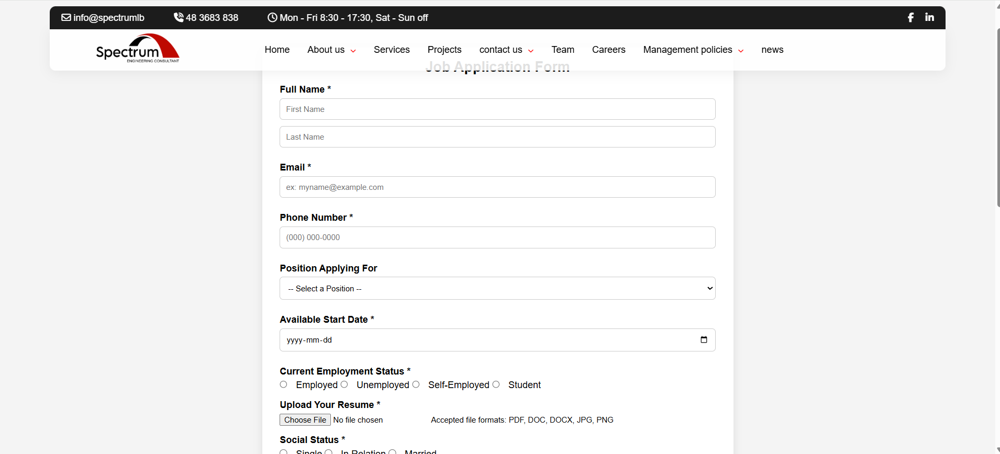

### Website Footer

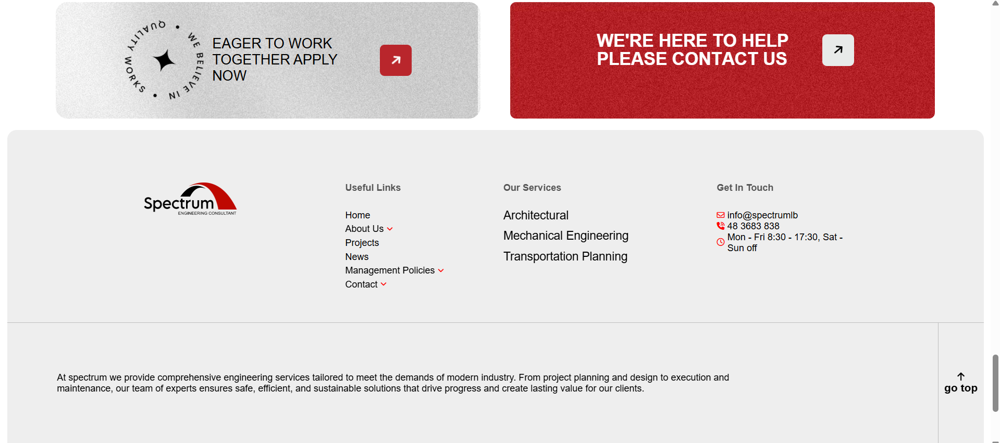

### Admin Login

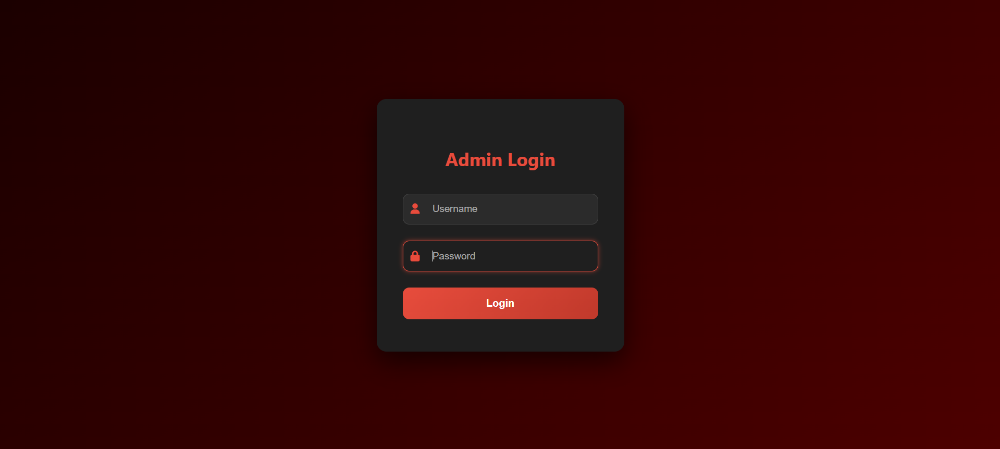

### Admin Dashboard

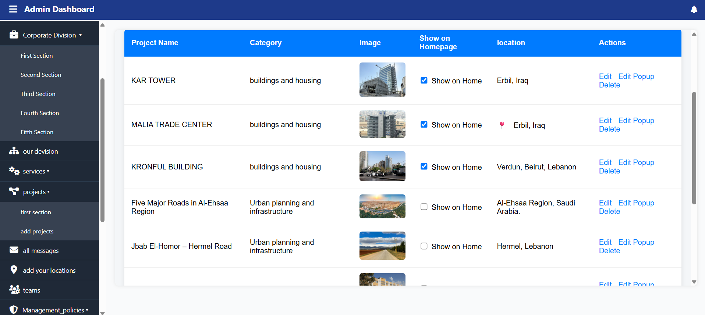

## Local Installation

### 1. Clone the repository

```bash
git clone https://github.com/imanSoleiman/Full-Stack-Engineering-Company-Website.git
```

### 2. Move the project to XAMPP

Place the project folder inside:

```text
C:\xampp\htdocs\
```

or your XAMPP installation directory.

For example:

```text
C:\xampp1\htdocs\spectrum
```

### 3. Start XAMPP

Start:

- Apache
- MySQL

### 4. Create the database

Open phpMyAdmin:

```text
http://localhost/phpmyadmin
```

Create the required MySQL database and import the SQL database file included with the project.

### 5. Configure the database connection

Update the PHP database connection settings to match your local MySQL configuration.

Typical XAMPP settings are:

```php
$host = "localhost";
$user = "root";
$password = "";
```

Use the database name configured for the project.

### 6. Run the website

Open:

```text
http://localhost/spectrum/
```

## Admin Dashboard

The project includes an admin authentication system and dashboard.

After logging in, the administrator has access to content-management features for the website.

The dashboard is designed to reduce the need to edit PHP, HTML, or database records manually when updating website content.


## Running the Backend with XAMPP

This project uses PHP and MySQL for the backend. XAMPP provides both the Apache web server and MySQL database server required to run the project locally.

### Step 1: Open XAMPP

Open the XAMPP Control Panel.

### Step 2: Start Apache

Click `Start` next to Apache.

Apache runs the PHP backend and serves the website through your browser.

When Apache starts successfully, its status should appear as running in the XAMPP Control Panel.

### Step 3: Start MySQL

Click `Start` next to MySQL.

MySQL runs the database used by the website and admin dashboard.

Both services should be running:

```text
Apache: Running
MySQL: Running
```

### Step 4: Place the Project in htdocs

Make sure the project folder is inside the XAMPP `htdocs` directory.

Example:

```text
C:\xampp1\htdocs\spectrum
```

### Step 5: Open phpMyAdmin

After Apache and MySQL are running, open:

```text
http://localhost/phpmyadmin
```

### Step 6: Create the Database

Create a new database using the database name required by the project.

Then select the database and choose the `Import` option.

Import the SQL file included with the project.

### Step 7: Check the Database Connection

Open the PHP file responsible for the MySQL connection.

Make sure the connection settings match your local XAMPP configuration.

A common XAMPP configuration is:

```php
$host = "localhost";
$user = "root";
$password = "";
$database = "your_database_name";
```

Replace `your_database_name` with the database name used by the project.

### Step 8: Open the Website

Open the project in your browser:

```text
http://localhost/spectrum/
```

Apache will execute the PHP files and connect them to the MySQL database.

### Step 9: Open the Admin Dashboard

Go to the admin login page from the project.

Use the default local development credentials:

```text
Username: admin
Password: 12345
```

These credentials are stored in `login.php`:

```php
$admin_user = "admin";
$admin_pass = "12345";
```

You may change them directly in `login.php`.

### Step 10: Manage Website Content

After logging in, the administrator can manage website content from the dashboard, including:

- Website logo
- Homepage images and sliders
- Company information
- Services
- Projects
- Project descriptions
- Project image sliders
- Team members
- Team images and information
- News
- News images
- Other dynamic website content

### If Apache Does Not Start

Check whether another program is using Apache's default ports, commonly port `80` or `443`.

You may also check the Apache logs from the XAMPP Control Panel.

### If MySQL Does Not Start

Check whether another MySQL service is already running on the computer.

You may also check the MySQL logs from the XAMPP Control Panel.

### Stopping the Backend

When you finish working on the project, return to XAMPP and click `Stop` next to:

```text
Apache
MySQL
```

## Admin Access

To access the admin dashboard locally:

1. Start Apache and MySQL from XAMPP.
2. Open the website in your browser.
3. Go to the admin login page.
4. Use the default development credentials:

```text
Username: admin
Password: 12345
```

The credentials are defined in `login.php`:

```php
$admin_user = "admin";
$admin_pass = "12345";
```

To change the admin username or password, open `login.php` and edit these values:

```php
$admin_user = "your_new_username";
$admin_pass = "your_new_password";
```

Save the file, then use the new credentials the next time you log in.

For a deployed website, replace these default credentials and avoid keeping production passwords directly in source code.

## How to Run the Project Step by Step

1. Install XAMPP.
2. Clone or download the project.
3. Place the project inside the XAMPP `htdocs` folder.

```text
C:\xampp1\htdocs\spectrum
```

4. Open XAMPP Control Panel.
5. Start Apache.
6. Start MySQL.
7. Open phpMyAdmin:

```text
http://localhost/phpmyadmin
```

8. Create the project database.
9. Import the provided SQL file into the database.
10. Check the PHP database connection file and make sure the database name, username, password, and host match your XAMPP setup.
11. Open the website:

```text
http://localhost/spectrum/
```

12. Open the admin login page.
13. Log in using:

```text
Username: admin
Password: 12345
```

14. From the admin dashboard, manage the website content such as:

- Logo
- Homepage sliders
- Company content
- Services
- Projects
- Project image sliders
- Team members
- Team images and information
- News
- News images
- Other dynamic website content


## Dynamic Project Management

Projects are managed through the admin dashboard.

For each project, the administrator can manage:

- Project name
- Project description
- Project information
- Project images
- Multiple slider images
- Content shown on the project section

## Dynamic Team Management

The team page is also connected to the admin dashboard.

Administrators can manage:

- Team members
- Member images
- Member information
- Team-related content

## Dynamic News Management

The news section allows administrators to add and manage company news.

Administrators can control:

- News titles
- News content
- News images
- News page information

## Animation

GSAP is used to create animations and interactive transitions across the website.

Animations help improve:

- Page loading experience
- Content transitions
- Section entrances
- Visual interaction
- User experience

## Purpose

This project demonstrates full-stack web development skills through a real company-style website with frontend design, backend development, database integration, content management, responsive layouts, and animation.

## Developer

Developed by Iman Soleiman.

## License

This project is available under the Apache License 2.0.
